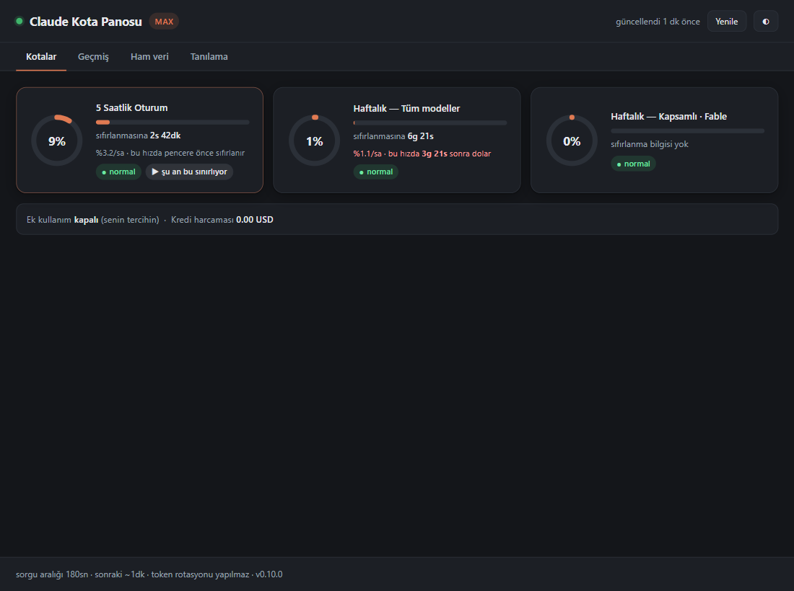
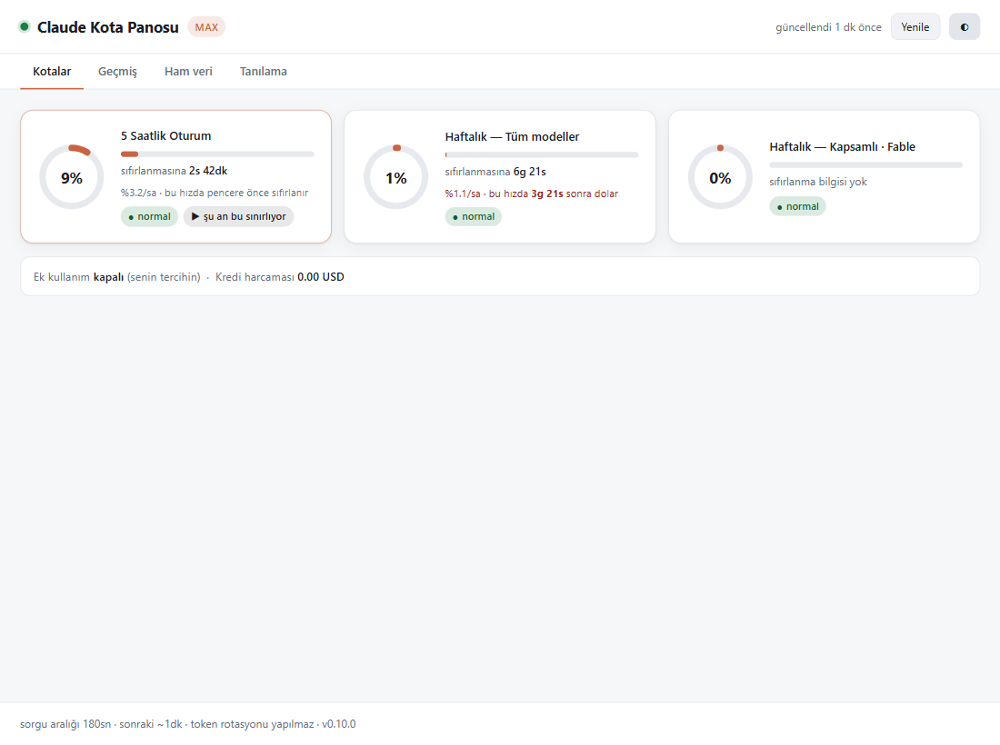

Claude'un **resmi** kota verisini yerel bir web panosunda gösterir: 5 saatlik
oturum penceresi, haftalık pencere, sıfırlanma geri sayımları ve 24 saatlik
geçmiş grafiği.

Ekranda sürekli yer kaplamaz — istediğinde tarayıcıda açarsın.

> **Not:** Bu proje artık aktif geliştirilmiyor; yerini
> [claude-code-intelligence](https://github.com/Furkiozknn/claude-code-intelligence)
> aldı. Buradaki kod çalışır durumda ve kullanılabilir, ama yeni özellikler
> ve bakım orada sürüyor.



<details>
<summary>Açık tema</summary>



</details>

## Neden

Mevcut araçlar ikiye ayrılıyor:

| | Resmi kota % | Şık arayüz | Ekran yeri |
|---|---|---|---|
| Tray / taskbar uygulamaları | ✅ | ❌ | Yer kaplar |
| Yerel analiz panoları (ccusage, token-dashboard) | ❌ sadece tahmini maliyet | ✅ | Sıfır |
| **Bu** | ✅ | ✅ | Sıfır |

`ccusage` ve benzerleri yerel JSONL loglarından **tahmini maliyet** hesaplar —
üç farklı araç aynı veriden üç farklı rakam üretebiliyor. Bu araç ise
Claude Code'un kendi kullandığı uçtan **gerçek kullanım yüzdesini** okur.

## Nazik olma politikası

Bu bölüm tasarımın merkezinde; hafife alma.

- **Sorgu aralığı** varsayılan **180 sn**. 60 sn'nin altına *inilemez*.
- **Hata durumunda** üstel backoff, en fazla **900 sn**.
- **Token rotasyonu yapılmaz.** `/api/oauth/usage` ucu token başına ~5 istekle
  sınırlı. Bazı araçlar limite çarpınca yeni OAuth token üretip sayacı
  sıfırlıyor — bu, Anthropic'in kendi hesabına koyduğu kötüye kullanım
  önlemini bilerek devre dışı bırakmak demek ve hesap işaretlenmesi riski
  taşır. Bu araç limite çarpınca **bekler** ve son bilinen değeri göstermeye
  devam eder.
- **Kimlik dosyası yalnızca okunur**, asla yazılmaz. Token'ın süresi dolmuşsa
  yenilemeye çalışmaz; sana "Claude Code'da bir komut çalıştır" der.
- **Ağ:** dışarı giden tek istek `api.anthropic.com`. Telemetri yok, hesap yok.
- **Bağlanma:** yalnızca `127.0.0.1`.

## Kurulum

Bağımlılık yok. Python 3.8+ yeterli.

```bash
python server.py
```

Windows'ta Python PATH'te değilse:

```powershell
& "C:\Users\<sen>\.local\bin\python3.12.exe" server.py
```

Pano `http://127.0.0.1:8110` adresinde açılır.

### Seçenekler

| Bayrak | Varsayılan | Açıklama |
|---|---|---|
| `--once` | — | Sunucu başlatma, durumu yazdır ve çık |
| `--compact` | — | Tek satır çıktı (statusline için). `--once` ima eder |
| `--port` | `8110` | Dinlenecek port (`PORT` değişkeni de olur) |
| `--interval` | `180` | Sorgu aralığı (sn), alt sınır 60 |
| `--db` | `~/.claude/quota-monitor.db` | Geçmiş veritabanı |
| `--notify-at` | `90` | Bu yüzde aşılınca Windows bildirimi. `0` = kapalı |
| `--no-browser` | — | Tarayıcıyı otomatik açma |
| `--host` | `127.0.0.1` | Değiştirmen önerilmez |

### Terminalden hızlı bakış

Tarayıcı açmadan, hatta sunucu çalışmadan:

```bash
$ python server.py --once
Claude kota — max
  Haftalık — Kapsamlı · Fable    [##########] 100%  KRITIK  sifir: 1s44dk  <
  Haftalık — Tüm modeller        [#########.]  86%  dikkat  sifir: 1s44dk
  5 Saatlik Oturum               [#######...]  68%  normal  sifir: 1s24dk
  kaynak: yerel sunucu

$ python server.py --compact
Fable 100%! | 7g 86%* | 5s 68%
```

`!` = kritik, `*` = dikkat, `<` = şu an seni fiilen sınırlayan limit.

**Önemli:** Bu mod önce çalışan sunucuya bakar. Sunucu ayaktaysa ondan okur
ve uca **ek sorgu gitmez** — nazik olma politikası korunur. Sunucu kapalıysa
tek bir doğrudan sorgu yapar.

Çıkış kodları: `0` başarılı, `2` token yok, `3` uç hata döndü, `4` kota
bilgisi bulunamadı. Betiklerden kullanışlı.

## Arayüz

- **Kotalar** — her pencere için halka grafik, yüzde, sıfırlanma geri sayımı.
  %70'te turuncu, %90'da kırmızı.
- **Geçmiş** — son 24 saatin çizgi grafiği. Sıfıra düşen yerler pencerenin
  sıfırlandığı anlar.
- **Ham veri** — uçtan gelen JSON, olduğu gibi.
- **Tanılama** — HTTP durumu, son deneme, backoff durumu, politika özeti.

## Ne tüketti?

Panonun **"Ne tüketti?"** sekmesi, resmi kota yüzdesini yerel transcript'lerle
ilişkilendirir. Diğer araçların yapmadığı şey bu: kota yüzdesini gösterenler
onu neyin doldurduğunu söylemiyor, tüketimi analiz edenler de resmi yüzdeye
erişemiyor.

```
Bu pencerede 190 tur · 5.8M ağırlıklı token · pencere doluluğu %16

Projeye göre
  D:\Claude Projeleri    ████████████  %100.0   pencerenin %16.0'ı
Modele göre
  claude-opus-5          ████████████  %100.0   pencerenin %16.0'ı
```

Pencerenin başlangıcı, ucun verdiği `resets_at`'ten geri sayılarak bulunur —
yani atıf tam olarak *o pencereyi dolduran* aralığı kapsar.

> **Dürüst sınır:** bu bir **oran tahmini**, kesin atıf değil. Anthropic
> yüzdenin hangi tokenlardan geldiğini söylemiyor; yerel token ağırlıklarına
> göre bölüşülüyor. Başka cihazdan veya claude.ai üzerinden yapılan kullanım
> buraya yansımaz. Ağırlık = girdi + çıktı + cache oluşturma; cache **okuma**
> ağırlığa katılmaz, ucuz olan o.

## Masaüstü widget'i

```bash
pythonw widget.py            # konsolsuz
python widget.py --mode mini
```

Çerçevesiz, her zaman üstte, sürüklenebilir küçük pencere. Kenara
yaklaşınca yapışır; ekran dışında kalmaz (monitör değişse bile görünür
alana çekilir).

| Mod | Ne gösterir |
|---|---|
| `full` | 3 satır — bütün pencereler |
| `compact` | 2 satır |
| `mini` | 1 satır — yalnızca şu an seni fiilen sınırlayan limit |

Sağ tık → boyut, tema, saydamlık, kapat. Çift tık → panoyu açar.
Konum/tema/mod/saydamlık `~/.claude/quota-widget.json`'a yazılır.

**Widget Anthropic'e istek atmaz.** Yerel sunucunun `/api/status` ucundan
okur. Tek veri kaynağı, çift sorgu yok, nazik olma politikası korunur.
Sunucu kapalıysa kendisi başlatır (`--no-autostart` ile kapatılır).

## Testler

```bash
python -m unittest discover -s tests -v
```

```bash
python tools/contrast_check.py
```

Palet renklerinin WCAG 2.2 AA kontrast oranlarını ölçer (normal metin 4.5:1,
arayüz bileşeni 3:1). Başarısızlık varsa çıkış kodu `1`. Renk seçimi göz
kararıyla değil ölçümle yapıldı — ilk denetimde 10 başarısızlık çıkmıştı.

43 test, bağımlılık yok. `tests/test_normalize.py` gerçek bir uç yanıtının
kopyasını fixture olarak tutuyor — şema değişirse veya ayrıştırıcı bozulursa
burada yakalanır. Kapsam: `limits` dizisinden kart üretimi, kod adı
gürültüsünün elenmesi, yedek yol, düzleştirilmiş şema, yüzde/tarih
dönüşümleri, bozuk girdiye dayanıklılık. `tests/test_one_shot.py` ise
`--once`/`--compact` çıktısını kapsar: ağ yok, yetki hatası (401), bozuk/boş
yanıt, token yok — hiçbiri çökmez, her biri anlaşılır bir mesaj ve doğru
çıkış koduyla biter.

## Ham veri sekmesi neden var

`/api/oauth/usage` **belgelenmemiş** bir uç. Anthropic'in genel API
referansında yok; Claude Code kendi arayüzü için kullanıyor. Şeması haber
verilmeden değişebilir.

Bu yüzden `normalize()` şekle bağımlı yazılmadı: gelen JSON'da yüzde ve
sıfırlanma benzeri alanları arayıp bulduğunu karta çevirir, hem iç içe hem
düzleştirilmiş şemaları dener. Hiçbir şey tanıyamazsa kartlar boş kalır ama
ham JSON her zaman durur — oradan bakıp ayrıştırıcı güncellenir.

## Veri nereye yazılır

Tek yazılan yer `~/.claude/quota-monitor.db` (SQLite, geçmiş grafiği için).
Silersen sadece geçmiş gider, araç çalışmaya devam eder.

## Bilinen sınırlar

- Uç belgelenmemiş; şeması değişirse ayrıştırıcı güncellenmeli.
- Yalnızca abonelik (Pro/Max) kotasını gösterir. API anahtarıyla kullanımı
  kapsamaz.
- Anthropic kesin token sayısı yayınlamıyor — gösterilen şey pencerelerin
  **yüzdesi**, "şu kadar token kaldı" değil.

## Lisans

MIT
